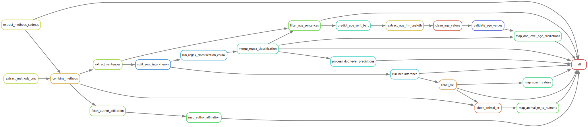

# Large-Scale Assessment of Animal-to-Human Drug Translation Using Natural Language Processing

## PubMed Query

### Setup
We used the EDirect package, which includes several commands that use the E-utilities API to find and retrieve PubMed data. You can install it via the command:
```
sh -c "$(curl -fsSL https://ftp.ncbi.nlm.nih.gov/entrez/entrezdirect/install-edirect.sh)"
```

Note:  For best performance, obtain an API Key from NCBI, and place the following line in your .bash_profile and .zshrc configuration files (follow https://support.nlm.nih.gov/kbArticle/?pn=KA-05317):
```
  export NCBI_API_KEY=unique_api_key
```

Relevant API documentation references:

- https://www.ncbi.nlm.nih.gov/books/NBK179288/
- https://www.nlm.nih.gov/dataguide/edirect/xtract_formatting.html
- https://dataguide.nlm.nih.gov/classes/edirect-for-pubmed/samplecode4.html#specify-a-placeholder-to-replace-blank-spaces-in-the-output-table

### From query to PMIDs list
To obtain the initial set of relevant PMIDs, the database was queried using several search string related to CNS and Psychiatric conditions, as follows:
- [./01_pubmed_query_neuro/PubMed_Query_Prep.ipynb](./01_pubmed_query_neuro/PubMed_Query_Prep.ipynb) - we first split the very long CNS related free text search queries into smaller chunks
- The chunks are found in [./01_pubmed_query_neuro/data/pubmed_queries/nervous_system/](./01_pubmed_query_neuro/data/pubmed_queries/nervous_system/). Those were executed iteratively with the script [./scripts/pubmed_query_long.sh](./01_pubmed_query_neuro/scripts/pubmed_query_long.sh). 
In addition MeSH based queries are in [./1_pubmed_query_neuro/data/pubmed_queries/nervous_system/cns_mesh_1.txt](./01_pubmed_query_neuro/data/pubmed_queries/nervous_system/cns_mesh_1.txt) and [./01_pubmed_query_neuro/data/pubmed_queries/nervous_system/cns_mesh_2.txt](./01_pubmed_query_neuro/data/pubmed_queries/nervous_system/cns_mesh_2.txt)

- Psychiatric conditions related queries: see [./01_pubmed_query_neuro/data/pubmed_queries/psychiatric/psychiatrich_query_used.txt](./01_pubmed_query_neuro/data/pubmed_queries/psychiatric/psychiatrich_query_used.txt).


The queries use the following syntax:
```
esearch -db pubmed -query '(Central nervous system diseases[MeSH] OR Mental Disorders OR Psychiatric illness[MeSH]) AND English[lang]' | efetch -format uid > "./cns_psychiatric_diseases_pmids_en_$(date +%Y%m%d).txt"
```

The outputs from those queries were stored in [./01_pubmed_query_neuro/data/pubmed_queries/results_pmids/](./01_pubmed_query_neuro/data/pubmed_queries/results_pmids/). They were then combined into a full list of PMIDs in [./01_pubmed_query_neuro/PubMed_Query_PMIDs_List.ipynb](./01_pubmed_query_neuro/PubMed_Query_PMIDs_List.ipynb).

### From PMIDs to content
1. Split into chunks of 5000 PMIDs per file, see [./01_pubmed_query_neuro/scripts/server/split_pmids_to_chunks.sh](./01_pubmed_query_neuro//scripts/split_pmids_to_chunks.sh)

2. Run parallel fetching of content on the surver for each chunk, see [./01_pubmed_query_neuro/scripts/server/fetch_pubmed_data_large_no_doi_with_retry.sh](./01_pubmed_query_neuro/scripts/fetch_pubmed_data_large_no_doi_with_retry.sh)

This executes the following call:
```
efetch -db pubmed -id "$id_list" -format xml 2>> error.log | \
        xtract \
          -pattern PubmedArticle -tab "|||" -def "N/A" \
          -element MedlineCitation/PMID PubDate/Year Journal/Title ArticleTitle AbstractText \
          -block PublicationTypeList -sep "+" -element PublicationType \
        > "$OUTPUT_FILE"
```

The script includes retries in case the API call fails.

However, there was always an incomplete set of returned results. Therefore after each iteration, we obtained the PMIDs for which no content was present, and re-ran the steps 1-3. Future work is to automate this process even further. The data is saved in [./01_pubmed_query_neuro/data/full_pubmed_raw/](./01_pubmed_query_neuro/data/full_pubmed_raw/). There are still some publications that kept failing, this can be checked with [./01_pubmed_query_neuro/check_failed_queries.py](./01_pubmed_query_neuro/check_failed_queries.py).


## Animal Studies Classification
The StudyTypeTeller full dataset is [./02_animal_study_classification/data/full_enriched_dataset_2696.csv](./02_animal_study_classification/data/full_enriched_dataset_2696.csv).

### Finetuning
1. Prep data for fine tuning. We split it into 90-10% for training and validation using the script [./02_animal_study_classification/generate_stratified_splits.py](./02_animal_study_classification/generate_stratified_splits.py).
2. Fine tune a binary classifier. The we use this split to fine-tune a binary SciBERT classifier, see [./02_animal_study_classification/run_finetune.sh](./02_animal_study_classification/run_finetune.sh).

### Inference 

3. Perform inference over the fetched PubMed abstracts. In the script [./02_animal_study_classification/run_parallel_inference.sh](./02_animal_study_classification/run_parallel_inference.sh), we point to the folder where the PubMed contents are stored from the previous step. Those are different chunks from the parallel fetching of PubMed contents. We parallelize the inference to predict the study type (animal vs other) for each publication. The predictions are stored to [./02_animal_study_classification/model_predictions/](./02_animal_study_classification/model_predictions/).
4. To quickly extract the PMIDs only of animal studies we used the command below, resulting in ./[02_animal_study_classification/model_predictions/all_animal_studies.txt](02_animal_study_classification/model_predictions/all_animal_studies.txt):
   ```
   find pubmed_results* -type f -name "*.txt" -exec grep 'Animal' {} + > all_animal_studies.txt
   ```
5. In a next step the full corpus of publications is filtered for the animal studies. This happens in [./02_animal_study_classification/filter_preclinical_pmids_save_for_ner.py](./02_animal_study_classification/filter_preclinical_pmids_save_for_ner.py). 
6. In the same script the animal studies are also split into chunks that will be used for inference for NER.

## Named entity recognition (NER) 

### Finetuning 
The datasets for fine-tuning are prepared in [./03_IE_tasks/0_Prep_NER_data.ipynb](./03_IE_tasks/0_Prep_NER_data.ipynb). 

The fine-tuning code is in [./03_IE_ner/train_bert_ner.py](./03_IE_ner/train_bert_ner.py) and the script to run in parallel on the server for k-fold cross-validation is in
 [./03_IE_ner/1_run_k_fold_parallel_experiment.sh](./03_IE_ner/1_run_k_fold_parallel_experiment.sh).

 HuggingFace evaluation results are then compared in [./03_IE_ner/Eval_Models_NER.ipynb](./03_IE_ner/Eval_Models_NER.ipynb). For drug and disease entities a separate detailed evaluation, e.g., allowing partial matches is in [./03_IE_ner/Eval_Drug_Disease_NER.ipynb](./03_IE_ner/Eval_Drug_Disease_NER.ipynb).
 

### Inference 
The animal studies were prepared for NER inference by splitting them into chunks of PMID and Text.
The inference code to run on the server over those chunks in parallel is [./03_IE_ner/2_run_ner_inference_animal.sh](./03_IE_ner/2_run_ner_inference_animal.sh). This calls [./03_IE_ner/inference_ner_annotations.py](./03_IE_ner/inference_ner_annotations.py), which in turn works with an NERModel from [./03_IE_ner/core/models.py](./03_IE_ner/core/models.py).


### Post-processing 
Post processing of the obtained NER predictions happens in [./03_IE_ner/3_process_ner_predictions.py](./03_IE_ner/3_process_ner_predictions.py). This includes:
1. Load NER Predictions  
   Reads NER model outputs (predicted entities) and excludes the articles have no predictions at all.

2. Abbreviation Expansion  
   For each article, if not already cached, the script extracts abbreviation-definition pairs from the full text to aid in resolving entity meanings. Save in [./03_IE_ner/data/abbreviations_expansion/pmid_abbreviations.csv](./03_IE_ner/data/abbreviations_expansion/pmid_abbreviations.csv).

3. Merge Predictions with Abbreviations  
   Joins abbreviation data with NER predictions by article (PMID).

4. Extract Unique Entities  
   For each article, extracts a unique list of predicted conditions and interventions, using both the NER predictions and abbreviation expansions.

5. Filter Articles  
   Keeps only those articles that mention at least one condition and one intervention.

6. Save Filtered Data  
   Saves in [./03_IE_ner/data/animal_studies_with_drug_disease/](./03_IE_ner/data/animal_studies_with_drug_disease/):
   - All qualifying articles with both entity types.
   - The corresponding PMIDs.
   - A subset of articles mentioning “sclerosis”, for focused study.

**Outputs:**

All saved files are written to the `03_IE_ner/data/animal_studies_with_drug_disease/` directory and include:

- Filtered articles with both condition and intervention mentions.
- PMIDs of those articles.
- Sclerosis-specific subset.

## Named entity normalization (NEN) 
To normalize the extracted entities we use:
1. Disease terms are mapped to MONDO, downloaded from [https://mondo.monarchinitiative.org/pages/download/](https://mondo.monarchinitiative.org/pages/download/).
2. Drug terms are mapped to UMLS. The "2024AB Full UMLS Release Files" was downloaded from [https://www.nlm.nih.gov/research/umls/licensedcontent/umlsknowledgesources.html](https://www.nlm.nih.gov/research/umls/licensedcontent/umlsknowledgesources.html). It is filtered for levels 0 (public) and 9 (SNOMED), as well as selected biomedical DBs. Further it is filtered for the semantic types "Organic Chemical", "Clinical Drug", "Biologically Active Substance", "Amino Acid, Peptide, or Protein", "Enzyme", "Immunologic Factor", "Nucleic Acid, Nucleoside, or Nucleotide", "Inorganic Chemical", "Antibiotic", "Biomedical or Dental Material", "Hormone", "Element, Ion, or Isotope", "Drug Delivery Device", "Vitamin", "Chemical Viewed Structurally", "Chemical".
3. DrugBank ressources: 
   1. The DrugBank database was downloaded from [https://go.drugbank.com/releases/latest](https://go.drugbank.com/releases/latest) (requires free registration). The terminology from drugbank_full_database.xml is prepared for mapping in [./04_normalization/Prep_Drugbank_for_Synonyms.ipynb](./04_normalization/Prep_Drugbank_for_Synonyms.ipynb).
   2. Further external IDs obtained directly from the website and not included in the xml.

### Pre-computed resources

While the below explanations give details about the process of embedding terminology and the linking process, you can download the named entity linking resources from [https://zenodo.org/records/19287944](https://zenodo.org/records/19287944). These files contain precomputed ontology embeddings and mappings required for drug and disease normalization.

After downloading, place them in the repository as follows:

```
./04_normalization/data/
                  ├── mondo/
                  │   ├── embeddings/
                  │   ├── mondo_term_id_pairs.json
                  │   └── mondo_id_to_term_map.json
                  └── umls/
                      ├── embeddings/
                      ├── umls_term_id_pairs_combined.json
                      └── umls_id_to_term_map.json 
```

The path to the data (DATA_DIR) has to be adjusted in [./04_normalization/run_normalize_parallel_drug.sh](././04_normalization/run_normalize_parallel_drug.sh), and [./04_normalization/run_normalize_parallel_disease.sh](././04_normalization/run_normalize_parallel_disease.sh).

### Overview of the flow
The overall flow for the normalization is as follows:
- Prepare: split the NER predictions into chunks for parallel processing: [./04_normalization/split_file_to_chunks.py](./04_normalization/split_file_to_chunks.py).
- **UMLS**: 
  - Prepare the UMLS synonyms vocabulary, including the final DrugBank mappings: [./04_normalization/Prep_UMLS_Synonyms_for_Embedding.ipynb](./04_normalization/Prep_UMLS_Synonyms_for_Embedding.ipynb).
  - Embed UMLS terms with SapBERT: [./04_normalization/embed_ontology.py](./04_normalization/embed_ontology.py)
  - Combine embeddings and term mappings for base UMLS terminology, UMLS synonyms, and DrugBank terms in [./04_normalization/umls_combine_mappings_for_nen.py](./04_normalization/umls_combine_mappings_for_nen.py).
  - Link drug entities to UMLS terms using neural NEN: [./04_normalization/run_normalize_parallel_drug.sh](./04_normalization/run_normalize_parallel_drug.sh) which calls [./04_normalization/neural_based_nen.py](./04_normalization/neural_based_nen.py).
  - Combine linked chunks in [./04_normalization/Combine_Linked_Preclinical_Chunks.ipynb](./04_normalization/Combine_Linked_Preclinical_Chunks.ipynb).
  - Map UMLS terms to parent CUIs in [./04_normalization/run_umls_map_to_parent.sh](./04_normalization/run_umls_map_to_parent.sh) which calls [./04_normalization/umls_map_to_parent.py](./04_normalization/umls_map_to_parent.py).
- **MONDO**:
  - Embed MONDO terms with SapBERT: [./04_normalization/embed_ontology.py](./04_normalization/embed_ontology.py)
  - Link condition entities to MONDO terms using neural NEN: [./04_normalization/run_normalize_parallel_disease.sh](./04_normalization/run_normalize_parallel_disease.sh) which calls [./04_normalization/neural_based_nen.py](./04_normalization/neural_based_nen.py).
  - Combine linked chunks in [./04_normalization/Combine_Linked_Preclinical_Chunks.ipynb](./04_normalization/Combine_Linked_Preclinical_Chunks.ipynb).
  - Clean up obsolete MONDO terms in [./04_normalization/run_mondo_clean_names.sh](./04_normalization/run_mondo_clean_names.sh) which calls [./04_normalization/mondo_clean_names.py](./04_normalization/mondo_clean_names.py).
  - Map MONDO terms to parent MONDOIDs in [./04_normalization/run_mondo_map_to_parent.sh](./04_normalization/run_mondo_map_to_parent.sh) which calls [./04_normalization/mondo_map_to_parent.py](./04_normalization/mondo_map_to_parent.py).

### MONDO/UMLS embedding via SapBERT
The script [./04_normalization/embed_ontology.py](./04_normalization/embed_ontology.py) generates vector embeddings for the ontology terms from MONDO and UMLS using the SapBERT model. 

The process involves:
- Loading ontology terms (from MONDO .owl files or UMLS .csv exports)
- Embedding term names using SapBERT
- Saving the resulting embeddings and term metadata for later use in normalization

**Files and Outputs**

MONDO:
- Input: mondo.owl
- Output: 
    - JSON file of (term name, MONDO ID) pairs
    - .npy files containing embeddings of MONDO terms

UMLS:
- Input: 
  - Unique IDs and corresponding canonical term (filtered from MRCONSO): [./04_normalization/data/umls/mrconso_filtered_db_and_sty_474316_drug_chemical_level_0_9.csv](./04_normalization/data/umls/mrconso_filtered_db_and_sty_474316_drug_chemical_level_0_9.csv)
  - UMLS synonyms file (filtered from MRCONSO): [./04_normalization/data/umls/mrconso_filtered_db_and_sty_synonyms.csv](./04_normalization/data/umls/mrconso_filtered_db_and_sty_synonyms.csv)
  - DrugBank selected terms (sourced from DrugBank): [./04_normalization/data/umls/mrconso_filtered_db_and_sty_drugbank_external_ids.csv](./04_normalization/data/umls/mrconso_filtered_db_and_sty_drugbank_external_ids.csv)
- Output:
    - JSON file of (term name, CUI) pairs
    - .npy files containing embeddings of UMLS terms
- Additional processing
  - Merging files of different terminologies in [./04_normalization/umls_combine_mappings_for_nen.py](./04_normalization/umls_combine_mappings_for_nen.py). Here we combine the embeddings and term mappings for the base UMLS terminology, UMLS synonyms, and DrugBank terms. Output:
    -  ["./data/umls/umls_id_to_term_map.json"](./data/umls/umls_id_to_term_map.json): mapping of canonical/unique UMLS CUIs to term names
    -  ["./data/umls/embeddings/UMLS_emb_batch_COMBINED.npy"](./data/umls/embeddings/UMLS_emb_batch_COMBINED.npy): combined UMLS embeddings; all terms incl synonyms
    -  ["./data/umls/umls_term_id_pairs_combined.json"](./data/umls/umls_term_id_pairs_combined.json): combined (term name, CUI) pairs; many terms have multiple CUIs due to synonyms
    -  shape of the last two objects should match!

### Selection of Best cdist Parameter
We manually annotated 100 randomly sampled disease and drug NER entities (see folder [./04_normalization/data/ner_samples/](./04_normalization/data/ner_samples/)). Each entity was then mapped to its closest SapBERT embedding from the relevant ontologies, and the embedding distance was recorded.

Using these distances, we estimated precision and recall at various cosine distance (cdist) thresholds. Entities with a distance above the selected threshold were not mapped and instead returned as the original NER text. For implementation details, see [./04_normalization/estimate_cdist_tsh_parameter.py](./04_normalization/estimate_cdist_tsh_parameter.py).

### Normalization Script
The script [./04_normalization/neural_based_nen.py](./04_normalization/neural_based_nen.py) performs entity normalization by mapping raw condition mentions (from NER output) to standardized MONDO/UMLS ontology terms. It uses the precomputed embeddings (from SapBERT) to match input terms to the closest ontology concept.

The normalization process:
- Loads MONDO/ UMLS embeddings and term metadata
- Uses a pretrained SapBERT model to embed query terms
- Computes similarity between query embeddings and ontology embeddings
- Maps terms to MONDO/UMLS if similarity is above a defined threshold, otherwise keeps the original NER output
- Logs normalization statistics and saves normalized results

**Files and Outputs**
Input:
- A CSV file containing annotated mentions (e.g., from NER)
- Column with mapped via dictionary condition/ drug strings (e.g. `linkbert_mapped_conditions`)
- MONDO/ UMLS embeddings (.npy files) and term metadata (.json)

Output:
- A new CSV with normalized MONDO/ UML mappings per row
- A summary stats log file with mapping performance.
- Logs of successfully and failed mapping entities.
- Normalized fields include e.g.:
    - `linkbert_mondo_conditions`: MONDO concept names
    - `mondo_termid`: MONDO concept IDs
    - `mondo_term_norm`: Canonical forms
    - `mondo_closest_3`: Top 3 closest MONDO concepts
    - `mondo_cdist`: Embedding distance to closest concept

To run this script on the server with data parallelism for drug/disease see [./04_normalization/run_normalize_parallel.sh](./04_normalization/run_normalize_parallel.sh):
```
sbatch run_normalize_parallel.sh disease
```

### Mapping to parent concepts
MONDO:
  - Mapping MONDO terms to parent MONDOIDs in [./04_normalization/mondo_map_to_parent.py](./04_normalization/mondo_map_to_parent.py).

UMLS:
  - Mapping UMLS terms to parent CUIs in [./04_normalization/umls_map_to_parent.py](./04_normalization/umls_map_to_parent.py). This script uses the MRREL file to find parent CUIs for each UMLS term, allowing normalization to higher-level concepts.

Finally, see [./04_normalization/Merge_Linked_Entities_for_Translation.ipynb](./04_normalization/Merge_Linked_Entities_for_Translation.ipynb). This notebook prepares a combined preclinical entity dataset by merging normalized **drug** and **disease** annotations at the publication level. 


## Validation 

### Validation with existing systematic reviews 

We took the following systematic reviews:
- [./04_syst_reviews_validation/data/Hyperoside.pdf](./04_syst_reviews_validation/data/Hyperoside.pdf)
- [./04_syst_reviews_validation/data/Lithium.pdf](./04_syst_reviews_validation/data/Lithium.pdf)
- [./04_syst_reviews_validation/data/Masitinib.pdf](./04_syst_reviews_validation/data/Masitinib.pdf)

And identified the expected animal article PMIDs saved in [./04_syst_reviews_validation/data/PMID.xlsx](./04_syst_reviews_validation/data/PMID.xlsx).

We check those target PMIDs are present in our dataset with the same drug and disease mentions. The code for that is in [./04_syst_reviews_validation/sys_review_validation.py](./04_syst_reviews_validation/sys_review_validation.py). 
This results in three files from the courpus filtered for the PMIDs of each systematic reviews and showing the unique extracted entities. 

## Full-text retrieval and methods extraction

### Full-text retrieval
#### PMC
[./07_full_text_retrieval/fetch_pmc_fulltext.py](./07_full_text_retrieval/fetch_pmc_fulltext.py)

This module automates the retrieval of full-text scientific articles from PubMed Central (PMC) using lists of PubMed IDs (PMIDs). It is designed for batch processing, enabling reproducible and resumable downloads of Open Access articles.

For each PMID, the code:
- Converts the PMID to a PMCID using the NCBI ID conversion API  
- Checks whether the article is available as Open Access  
- Attempts to download the full text in **BioC JSON** format  
- Falls back to **PMC OAI XML** if JSON is unavailable  
- Stores results locally and logs progress for restartability   
  

#### Cadmus

See https://github.com/biomedicalinformaticsgroup/cadmus.

[./07_full_text_retrieval/cadmus_job.sh](./07_full_text_retrieval/cadmus_job.sh)

This component runs large-scale full-text retrieval using the `cadmus` library on a high-performance computing (HPC) cluster managed by SLURM. It extends beyond PMC Open Access by leveraging publisher APIs (e.g., Wiley, Elsevier) alongside NCBI services to maximize full-text coverage.

The pipeline:
- Loads a list of PMIDs from a text file  
- Removes duplicates and prepares a batch for processing  
- Loads API keys (NCBI, Wiley, Elsevier) from a secure file  
- Uses `cadmus.bioscraping` to retrieve full-text content from multiple sources  
- Runs as a scheduled SLURM job with logging and resource control  

### Methods extraction
#### From PMC BioC fromat
The methods extraction from PMC BioC format is done in [./07_full_text_retrieval/extract_methods_from_bioc_json.py](./07_full_text_retrieval/extract_methods_from_bioc_json.py). It uses several strategies to extract the methods section from the full text BioC XML of the publications.


#### From Cadmus
All CADMUS outputs are processed by format-specific parsers in: [./07_full_text_retrieval/cadmus_extractors/](./07_full_text_retrieval/cadmus_extractors/). The parser are develed for:
- **XML** (`xml_extractor.py`)  
  Parses XML files, finds the “Materials and Methods” section (or JATS-style `<sec>`), and outputs `methods_subtitles_<PMID>.csv`
- **HTML** (`html_extractor.py`)  
Loads HTML ZIPs, applies several strategies (e.g. `<section data-title="…">`, `<div id="methods">`, OVID/NLM layouts, etc.) to locate M&M text, and writes `methods_subtitles_<PMID>.csv`.
- **PDF** (`pdf_extractor.py`)  
Uses PaperMage to extract section headings and paragraphs. Looks for the first “Materials and Methods” heading, collects its text and subsections, then writes two CSVs under the output folder:
  - `<PMID>_sections.csv` (one row per subsection)
  - `<PMID>_full_text.csv` (all M&M text in one row)
- **Plain Text** (`plain_extractor.py`)  
Reads `.txt` files, uses a regex to locate “Materials and Methods” headings, applies heuristics to skip false positives, and saves `methods_subtitles_<PMID>.csv`.

**Workflow Overview**
Those parsers are used in the main file [./07_full_text_retrieval/extract_methods_from_cadmus.py](./07_full_text_retrieval/extract_methods_from_cadmus.py). The workflow is as follows:
1. **Load metadata**  
 Read `retrieved_df2.json.zip` into a DataFrame of PMIDs and parse paths.
2. **Filter out unwanted rows** (this is relevant only for the MS studies for which all PMIDs were fetched, but not all were relevant)
    - Exclude PMIDs in “wrong study type” CSVs.  
    - Remove any row where `xml = 0 && html = 0 && pdf = 0 && plain = 0`.
3. **Attempt each parser in order**  
 For each remaining PMID the parsers are attempted in the following order: XML -> HTML -> PDF -> Plain Text. As soon as one returns success, record its subtitle count and move on.
4. **Logging & Summaries**  
    - Each parser writes logs under `materials_methods/logs/<format>/`.  
    - If no parser succeeds, the PMID is appended to `logs/missing_files.txt`.  
    - At the end, per-format summary files (`summary_stats_<format>.txt`) and an overall summary (`overall_summary_stats.txt`) are generated.

### Sentences extraction
The sentences extraction from the full text is done in [./07_full_text_retrieval/extract_sentences.py](./07_full_text_retrieval/extract_sentences.py). It uses the `nltk` library to tokenize the text into sentences. The script processes each methods section file and saves the sentences in a structured format for further analysis.
1. Reads raw text from a specified column in an input CSV.
2. Splits text into “preliminary” sentences using NLTK’s Punkt tokenizer.
3. Re-tokenizes each preliminary sentence into word/punctuation tokens -> needed espiecially for scientific texts.
4. Merges consecutive sentences if they match “no-split” patterns (false positive splits).
5. Writes out a CSV where each row corresponds to one (possibly merged) sentence.
   
## Full-text information extraction


### Snakemake pipeline 

This Snakemake workflow performs end-to-end information extraction from the full-text methods sections. It was used on a cluster using Slurm, parallelizing extraction, inference, and post-processing steps to produce structured, document-level variables.



#### Pipeline Steps

1. **Extract methods text**  
   - From PMC BioC JSON and Cadmus outputs (parallelized per input folder)

2. **Combine and clean methods**  
   - Merge all extracted texts into a unified JSONL corpus  
   - Optionally exclude known problematic study types  

3. **Prepare inputs for extraction**  
   - Extract sentence-level representations  
   - Split texts into chunks for scalable parallel processing  

4. **Regex-based classification**  
   - Run category-specific regex classifiers on sentence chunks  
   - Merge chunk-level outputs into final category and document-level predictions  

5. **NER-based extraction**  
   - Run transformer-based NER models on text chunks  
   - Support multiple model types (config-driven)  
   - Produce structured predictions (e.g., strain, animal numbers)  

6. **Clean and normalize NER outputs**  
   - Post-process predictions into dataset-specific structured outputs  

7. **Age extraction pipeline**  
   - Filter candidate sentences  
   - Classify with BERT  
   - Extract values using LLM  
   - Clean and validate predictions  
   - Map to document-level age variables  

8. **Final normalization and mapping**  
   - Convert animal numbers to numeric values  
   - Standardize strain names via synonym mapping  
   - Map validated age predictions to documents  
   - Fetch and map author affiliations to geolocations  

**Outputs:**  
Structured, document-level variables including regex predictions, animal numbers, strain labels, age estimates, and affiliation geolocation.


#### Execution (Slurm Profile)

This workflow is designed to run on a Slurm cluster using a Snakemake profile.

**Example profile config** (`~/.config/snakemake/slurm/config.yaml`)
```yaml
executor: slurm
jobs: 200

# Enable environments
use-conda: true
conda-frontend: mamba          # or "micromamba" / "conda"
conda-prefix: /data/$USER/smk-conda
envvars: [CONDA_PKGS_DIRS]

default-resources:
  slurm_account: animalwelfare.crs.uzh
  cpus_per_task: 2
  mem_mb: 3700
  runtime: 1h

set-resources:
  extract_age_llm_unsloth:
    slurm_extra: "'--gpus=H100:1'"
  predict_age_sent_bert:
    slurm_extra: "'--gpus=V100:1'"
```
**Running the workflow** 
```bash
sbatch --cpus-per-task=1 --mem=8000 --time=125:00:00 -o log/main_%j --wrap="\
  export CONDA_PKGS_DIRS=/data/$USER/conda_pkgs; \
  snakemake --profile slurm --use-conda -j 50 -p \
  --rerun-incomplete"
```

#### Annotation and metadata aggregation

After the individual information-extraction outputs are generated, this step consolidates them into a single analysis-ready table. See [./09_corpus_analysis/01_Prep_Annotations.ipynb](./09_corpus_analysis/01_Prep_Annotations.ipynb).

1. **Load study metadata and disease/drug annotations**  
   - Reads the preclinical study metadata table (PubMed details)
   - Reads normalized disease/drug annotations (NER step on the abstracts)
   - Merges them into a metadata-enriched reference table

2. **Load document-level full-text annotations**  
   - Collects the outputs from the IE pipeline, including:
     - animal sex
     - animal species
     - blinding
     - randomization
     - welfare
     - assay type
     - animal strain
     - animal number
     - sample size
     - first-author country

3. **Merge annotation sources into one table**  
   - All document-level annotation files are merged on `PMID`
   - Missing values are filled with `"not reported"` so downstream analyses have consistent labels

4. **Join annotations with metadata**  
   - The merged annotation table is then joined with the metadata/disease/intervention table
   - This creates one row per publication with both extracted full-text variables and article-level metadata

5. **Write final combined dataset**  
   - The final output is saved as:
```text
full_text_combined_all_annotations_metadata.csv
```

The output is a single document-level dataset that combines:
- extracted reporting variables from full text
- normalized disease and intervention labels
- publication metadata such as year, journal, publication type, and title

---
## Trends in animal study characteristics

This step summarizes the prevalence of extracted animal study characteristics and methodological rigor indicators across the corpus. It focuses on the most commonly observed annotations and examines how these characteristics change over time.

The analysis reports both:
- the **absolute number of articles** with a given characteristic, and
- the **proportion of articles** in which that characteristic is observed.

This provides a descriptive overview of reporting patterns in the dataset, including changes in study design and rigor-related variables across publication years.

The corresponding visualizations are available in [./09_corpus_analysis/02_Viz_Annotations_Metadata.ipynb](./09_corpus_analysis/02_Viz_Annotations_Metadata.ipynb).

---
## Animal-to-human translation analysis

### Drug-level translation proportions
[./10_drug_disease_translation_analysis/Translation_01_Drug.ipynb](./10_drug_disease_translation_analysis/Translation_01_Drug.ipynb)

This notebook quantifies how often drug entities identified in the **preclinical literature** also appear in the **clinical trial landscape**, and how far those translated drugs progress in development. It operates at the **drug level** rather than the drug–disease pair level, meaning a drug is considered translationally relevant if it appears in both preclinical and clinical datasets, regardless of indication.

The workflow:
- loads normalized preclinical drug–disease entity data
- loads normalized clinical trial drug–disease entity data
- explodes multi-valued drug and disease columns into row-level entities
- aggregates **evidence per drug**
- integrates **FDA approval information**
- computes summary metrics for:
  - any clinical appearance
  - progression to **Phase 3 completed**, **Phase 4**, or **FDA approval**

The following input files must be provided locally. You will need to **adjust the file paths** depending on your environment.

#### 1. Preclinical linked entities  
**Variable:** `FILE_PRECLINICAL_LINKING`  

**Example path:**  
`/shares/animalwelfare.crs.uzh/Preclinical_Pipeline/04_normalization/data/mapped_all/entities_drug_disease_preclin.csv`  

**Download source:**  
- Zenodo: https://zenodo.org/records/19390481  
- File location inside archive:  
  `04_normalization.zip → data/mapped_all/entities_drug_disease_preclin.csv`  

#### 2. Clinical linked entities  
**Variable:** `FILE_CLINICAL_LINKING`  

**Example path:**  
`/scratch/sdonev/Clinical_Pipeline/data/linked_to_ontologies/entities_drug_disease_clin.csv`  

**Download source:**  
- Zenodo: https://zenodo.org/records/19351891  


#### 3. Clinical metadata (AACT)  
**Variable:** `FILE_CLINICAL_METADATA`  

**Example path:**  
`/scratch/sdonev/Clinical_Pipeline/data/raw_aact/mv_interventional_drug_studies_20260222.csv`  

**Download source:**  
- Zenodo: https://zenodo.org/records/19351891  

#### 4. FDA drug approval data  
**Variable:** `FDA_FILE`  

**Example path:**  
`/shares/animalwelfare.crs.uzh/Preclinical_Pipeline/10_use_case_disease_focus/out/df_ds_drugs_with_FDA_info.csv`  

**Download source:**  
- GitHub: https://github.com/Ineichen-Group/FDA_DrugDisease_Pipeline/blob/main/out/df_ds_drugs_with_FDA_info.csv  

### Drug<>Disease-level translation proportions

[./10_drug_disease_translation_analysis/Translation_02_Drug_Disease.ipynb](./10_drug_disease_translation_analysis/Translation_02_Drug_Disease.ipynb)

This notebook builds a **drug–disease pair–level translation dataset** by linking normalized preclinical literature pairs to normalized clinical trial pairs and then enriching the merged result with **trial timing**, **phase progression**, and **FDA drug–disease approval information**.

Unlike the drug-only translation analysis, this workflow operates on explicit:

- **disease <> drug** pairs in the preclinical literature
- **disease <> drug** pairs in clinical trials
- **disease <> drug** pairs in FDA approval data

The goal of this first part is to prepare a harmonized dataset that can later be used to assess whether a specific preclinical drug–disease pair translates into clinical development or approval.

At a high level, the notebook:
- loads normalized preclinical and clinical entity datasets
- expands multi-valued disease and drug annotations
- adds publication year for preclinical studies
- adds start/completion/submission year information for clinical trials
- aggregates evidence at the  `disease <> drug` **pair level**
- merges preclinical and clinical pair evidence
- derives trial phase summary features
- integrates FDA drug–disease approval mappings
- computes translation statistics at the **pair level**

In addition to the preclinical and clinical linking files already listed, this notebook also requires the following extra inputs:


#### 1. Preclinical publication metadata  
**Variable:** `PRECLINICAL_METADATA_PATH`  

**Example path:**  
`/shares/animalwelfare.crs.uzh/Preclinical_Pipeline/02_animal_study_classification/data/animal_studies/full_pubmed_filtered_animal_6002827_metadata.csv`  

**Download source:**  
- Zenodo: https://zenodo.org/records/19390481  
- File location inside archive:  
  `02_animal_study_classification.zip → data/animal_studies/full_pubmed_filtered_animal_6002827_metadata.csv`  

**Used for:**  
- adding publication year (`pub_year`) to preclinical studies

#### 2. FDA drug–disease pair mapping  
**Variable:** `FDA_FILE`  

**Example path:**  
`/shares/animalwelfare.crs.uzh/Preclinical_Pipeline/10_use_case_disease_focus/out/FDA_drug_disease_pairs_mapped_both.csv`  

**Download source:**  
- GitHub: https://github.com/Ineichen-Group/FDA_DrugDisease_Pipeline/blob/main/out/FDA_drug_disease_pairs_mapped_both.csv  

**Used for:**  
- adding FDA-approved disease–drug pairs
- computing overlap with preclinical and clinical pairs

### Translation Table Preparation and Neuro Subsetting

[./10_drug_disease_translation_analysis/Translation_03_0_Prep_Pairs_for_Associations.ipynb](./10_drug_disease_translation_analysis/Translation_03_0_Prep_Pairs_for_Associations.ipynb)

This notebook builds a unified **drug–disease translation table** using datasets generated in **Translation_02_Drug_Disease**, and extracts **neurological subsets** for downstream analysis.

#### 1. Merge Translation Tables
- Load full translation table  
- Add FDA-only pairs (flagged as `fda_only`)  
- Concatenate into a single dataset  


#### 2. Neuro Filtering

A. Keyword-Based (17 Categories)
- Match disease terms using a curated keyword dictionary  
- Assign to predefined neurological disease groups  
- Output: `translation_table_drug_disease_NEURO_17.csv`

B. Ontology-Based
- Match against a list of neurological diseases  
- Uses regex-based matching  
- Output: `translation_table_drug_disease_NEURO.csv`

### Descriptive Pair-Level Analysis of Animal Study Characteristics
[./10_drug_disease_translation_analysis/Translation_04_Preclinical_Associations_Drug_Disease.ipynb](./10_drug_disease_translation_analysis/Translation_04_Preclinical_Associations_Drug_Disease.ipynb)

This workflow uses integrated **drug–disease translation tables** to derive preclinical study features for each pair and compares characteristics of **translated** versus **non-translated** pairs.

The resulting datasets support three main goals:
1. identifying the subset of preclinical studies that occurred before key clinical milestones,
2. generating pair-level feature tables for donstream descriptive and statistical association analyses,
3. descriptive pair-level analysis comparing the characteristics of animal studiess proceeding translated or non-translated drug-disease pairs.

A key point is that some downstream analyses in this project use only articles with available **full text**. This can reduce the number of included entities and studies relative to the full translation table.

#### 1. Load translation tables
The notebook starts from translation tables generated in earlier pipeline steps. Depending on the selected dataset, it loads one of the prepared outputs such as:
- full dataset,
- neuro-only subset.

These tables contain integrated preclinical, clinical, and FDA-based translation annotations for each normalized **drug–disease pair**.

#### 2. Define translation outcome
Each pair is classified into a translation status:
- **approved / translated** if it reached at least one Phase 4 trial, at least one completed Phase 3 trial, or has FDA approval information,
- **failed / non-translated** otherwise.

This creates the main comparison groups used throughout the notebook.

#### 3. Identify relevant clinical timing
For translated pairs, the notebook estimates the earliest relevant clinical milestone year using:
- first Phase 4 year,
- first completed Phase 3 year,
- earliest FDA approval year.

For non-translated pairs, the latest available clinical trial start year is used as a reference point.

These timing variables allow the analysis to distinguish preclinical studies published **before** clinical translation from those published later.

#### 4. Restrict to preclinical studies before clinical milestones
For each pair, the notebook parses the stored preclinical PMID lists and publication years, then keeps only studies published before the relevant clinical cutoff:
- **before first relevant clinical milestone** for translated pairs,
- **before latest trial start year** for failed pairs.

This yields the subset of preclinical studies most relevant for evaluating whether preclinical evidence preceded later translation outcomes.

#### 5. Retrieve annotated preclinical studies
The selected PMID subsets are joined to the full-text preclinical annotation dataset, which contains study-level metadata and extracted characteristics such as:
- animal species,
- sex,
- strain,
- assay type,
- country,
- reporting of blinding,
- reporting of randomization,
- reporting of welfare,
- sample size annotations.

Separate article-level datasets are created for translated and failed subsets, then merged into a combined preclinical analysis table.

#### 6. Build article-level and pair-level outputs
The notebook exports:
- a **flat article-level table** with one row per included preclinical study,
- an **aggregated pair-level table** summarizing all supporting studies for each drug–disease pair.

These outputs form the basis for descriptive summaries and downstream association analyses.

#### 7. Derive experimental heterogeneity and rigor features
For each drug–disease pair, the notebook computes summary variables describing the diversity and reporting quality of the preclinical evidence base, including:
- whether both sexes were tested,
- number of unique species,
- number of unique strains,
- number of unique assays,
- number of unique countries,
- number of supporting articles,
- number of articles reporting blinding,
- number of articles reporting randomization,
- number of articles reporting welfare.

Binary indicators are also derived for whether a pair has evidence from at least two species, strains, assays, or countries, and whether at least one supporting study reports each rigor item.

#### 8. Compare translated and non-translated pairs
The aggregated features are compared between:
- **approved / translated pairs**,
- **failed / non-translated pairs**.

This produces summary tables that quantify differences in preclinical heterogeneity and rigor-related reporting across the two outcome groups.

#### 9. Prepare association-analysis input
A final analysis-ready table is created where each row represents one drug–disease pair and includes:
- engineered preclinical summary features,
- a binary target variable indicating translation outcome.

This dataset is intended for downstream statistical analyses and predictive modeling.

#### 10. Validation and visualization
The notebook also creates:
- sampled examples for manual validation,
- outlier subsets,
- publication-year summaries,
- exploratory plots of feature–target relationships,
- visualizations comparing preclinical evidence with clinical counts and translation timing.

Together, these outputs provide a structured basis for analyzing how properties of the preclinical evidence base relate to later clinical translation and approval.

---
## Detailed docu of the IE modules is provided below.
### Regex-based extraction

This script ([./08_IE_full_text/regex_runner.py](./08_IE_full_text/regex_runner.py)) applies one or more regex-based classifiers to a CSV file containing text data. It supports the following classification categories: `sex`, `species`, `welfare`, `blinding`, `randomization`,  `assay` and `age`. You can run a specific classifier or all of them in sequence.

Each classifier processes a specified text column and outputs a CSV file with encoded prediction results. In the current imoplementation, the text column contains the sentences extracted from the methods section of the full text. The regex patterns are defined in a separate file, which is loaded at runtime. They can be found in [./08_IE_full_text/regex_classifiers/](./08_IE_full_text/regex_classifiers/) and are organized by classifier type, and abstracted in the base class [./08_IE_full_text/classifiers/regex_base.py](./08_IE_full_text/classifiers/regex_base.py).

This abstract base class (`RegexClassifier`) defines the structure for all regex-based classifiers used in the project. It ensures a consistent interface and behavior across classifiers.

Each subclass must implement:
- `compile_patterns(self)`: Compiles the regular expressions needed for classification.
- `classify(self, text: str)`: Applies classification logic to the input text and returns a prediction.

Helper methods:
- `_find_first_match(regex_obj, text)`: Returns the first regex match, if any.
- `_find_all_matches(regex_obj, text)`: Returns all matches as a list.

All regex-based classifiers (e.g., `SexClassifier`, `BlindingClassifier`) inherit from this base class.

### Special Case: Assay/Readout Information Extraction

The `AssayClassifier` is a subclass of `RegexClassifier` designed for extracting assay and outcome readout information. It uses a CSV vocabulary of canonical test names and synonyms to detect mentions of experimental assays in text. The final vocabulary is saved in [08_IE_full_text/data/assay_extraction/assay_final_harmonized_with_enriched_synonyms.csv](08_IE_full_text/data/assay_extraction/assay_final_harmonized_with_enriched_synonyms.csv). The processing of the assay vocabulary can be found in [03_IE_tasks/Harmonize_Outcomes_Assay_Library.ipynb](03_IE_tasks/Harmonize_Outcomes_Assay_Library.ipynb).

To build the assay vocabulary:

- Several review papers across domains (e.g., neuroscience, physiology, pharmacology) were reviewed. The outputs are in [03_IE_tasks/data/related/outcomes_endpoints](03_IE_tasks/data/related/outcomes_endpoints).
- For each article, a structured assay table was constructed with the help of ChatGPT in the following format:

```
Test Name	Measure	Outcome Domain	Subdomain
Microarray analysis	Fold-change in expression or hybridization intensity across all array probes	Molecular & Cellular	Transcriptomics
SNP analysis	Allele frequency and genotype calls across genome-wide SNP panels	Molecular & Cellular	Genomics
```

- Each test was assigned to one of five outcome domains:

  1. **Behavioural**  
     *Definition:* Any overt animal action or choice—motor, sensorimotor, cognitive, social, or affective/pain-related  
     *(e.g., rotarod, open field, elevated plus maze, hyperreflexia, seizure)*

  2. **Imaging**  
     *Definition:* Includes **in vivo** medical imaging (e.g., MRI, PET, CT). Does **not** include microscopy or photographic images.

  3. **Histology**  
     *Definition:* Structural and cellular-level visualization methods, typically involving tissue sectioning and staining (e.g., Nissl, H&E, LFB), often coupled with various types of microscopy.

  4. **Physiology**  
     *Definition:* Vital signs, metabolic readouts, body composition, pharmacokinetics, and survival  
     *(e.g., heart rate, blood pressure, body weight, blood flow, EEG, EMG)*

  5. **Molecular & Cellular**  
     *Definition:* Covers analyses that quantify or characterize molecular components (DNA, RNA, proteins, metabolites) or cellular properties (e.g., cell types, activation states) using laboratory assays  
     *(e.g., Western blot, qPCR, RNA-seq, ELISA, mass spectrometry, FACS)*

- Test names were harmonized into canonical forms. 
- Synonyms for each test were generated and enriched using ChatGPT. The synonyms are in the file [03_IE_tasks/data/related/outcomes_endpoints/harmonized_synonyms_GPT.xlsx](03_IE_tasks/data/related/outcomes_endpoints/harmonized_synonyms_GPT.xlsx). 

The final harmonized vocabulary was saved as a CSV file and used to compile regex patterns for each assay category. These patterns are used at runtime to extract structured assay information from unstructured text.

The classifier returns:
- A multi-hot vector indicating matched assay categories
- A list of matched outcome domains
- A mapping from matched domains to the canonical test names found


#### Special Case: Age Information Extraction 

Age classification follows a multi-step pipeline due to the high likelihood of false positives from simple regex matching. The process includes regex filtering, machine learning classification, and LLM-based age value extraction. The scripts for this are located in the [./08_IE_full_text/age_classifier/](./08_IE_full_text/age_classifier/) directory.


**1. Sentence Filtering with Regex**

After applying the regex-based age classifier, sentences containing age-related keywords are filtered using:

`./08_IE_full_text/extract_age_sentences.py`  
→ Extracts only sentences matched by age-related regex patterns.


**2. Sentence Classification with Machine Learning**

Due to many false positives, a BERT-based classifier is trained to distinguish between:
- **True Age Sentences** (actual age info)
- **False Positives** (irrelevant mentions)

Training:
`./08_IE_full_text/age_classifier/Age_Sentence_Classifier_Train.ipynb`  
→ Trained on manually annotated age-labeled data.

Inference:
`./08_IE_full_text/age_classifier/age_sent_clssifier_bert.py`  
Run via: `./08_IE_full_text/age_classifier/run_age_sent_classifier_bert.sh`


**3. Age Value Extraction with LLM**

To extract the actual age values from true age sentences, a lightweight fine-tuned LLM is used.

Model:
`./08_IE_full_text/age_classifier/LLM_Unsloth.ipynb`  
→ A fine-tuned version of Unsloth (optimized for fast inference).

Inference:
`./08_IE_full_text/age_classifier/LLM_Unsloth_Inference.ipynb`  
→ Applies the LLM to extract age values from each true age sentence.

**Postprocessing**

- [./08_IE_full_text/clean_age_llm_predictions.py](./08_IE_full_text/clean_age_llm_predictions.py)  
  Cleans and processes the LLM predictions, including abbreviation expansion and unique entity extraction.

**4. Age Classification**
The script in [08_IE_full_text/classify_age_predictions.py](08_IE_full_text/classify_age_predictions.py) processes the age-related predictions and classifies them as `young`, `adult`, or `aged`. It also normalizes inconsistent formats and applies species-based filtering.

- **`classify_age(age_in_weeks)`**  
  Classifies:
  - `< 8` weeks → `young`
  - `8–59` weeks → `adult`
  - `≥ 60` weeks → `aged`

- **`map_to_weeks(value, unit)`**  
  Converts `days`, `months`, or `years` to weeks.

- **`normalize_age_string(age_str)`**  
  Cleans age strings (e.g., `"10-week-old"` → `"10 weeks"`).

- **`process_age_predictions(pred_str)`**  
  Parses and classifies comma-separated age mentions; handles ranges and malformed formats.

- **`classify_age_prediction(df, pred_col, species_df)`**  
  Applies classification only if supporting sentences contain **only** `mouse`, `rat`, or `species-other`.

Only mouse/rat rows are processed. Others are marked as `"not processed"`.


### NER-based extraction
See above NER section for details on the NER-based extraction of conditions and interventions from the full text.

**Postprocessing**
- [./08_IE_full_text/clean_ner_predictions.py](./08_IE_full_text/clean_ner_predictions.py)  
  Cleans and processes the NER predictions, including abbreviation expansion and unique entity extraction.

#### Animal Strain Normalization
The notebook [./08_IE_full_text/Strain_Normalization.ipynb](./08_IE_full_text/Strain_Normalization.ipynb) standardizes strain names using string matching and ontology-driven mapping.

- **Input:** Sentences containing raw strain mentions, e.g., `"C57bl6/j mouse"` or `"Sprague Dawley rats"`.

- **Normalization Approach:**
  - Preprocess input text (lowercase, strip punctuation, remove stopwords).
  - Match to canonical strain names using:
    - Exact match
    - Fuzzy string similarity (`difflib.get_close_matches`)
    - Synonym mapping (via lookup table)

- **Strain Ontology:**
  - A manually curated mapping of:
    - Canonical strain name
    - Known variants/synonyms
    - Common substrings and aliases
  
  The strain mapping was built from both public databases and programmatic extraction of aliases:

  - Rat Strains
    - **Source:** [Rat Genome Database (RGD)](https://rgd.mcw.edu/)
    - Provided canonical names and synonyms for common rat strains.
  - Mouse Strains
    - **Sources:**
      - [Mouse Phenome Database](https://phenome.jax.org/downloads)
      - [International Mouse Strain Resource (IMSR)](https://www.findmice.org/index)

- **Alias Extraction:**  
  Additional aliases were scraped from strain detail pages.

- **Key Variables/Columns:**
  - `raw_strain` – original text input
  - `normalized_strain` – matched canonical strain name
  - `match_score` – similarity score used in fuzzy matching

- **Output:** A DataFrame with raw and normalized strain names.


#### Animal Number Extraction
After the NER-based extraction, we ensure that the number extracted likely refers to the number of animals used in the study. For that we find the mention of the number extracted in the methods section, and check if it is in the context of "animals" or a specific species. This is done in the script [08_IE_full_text/clean_animal_nr.py](08_IE_full_text/clean_animal_nr.py). Only the NER outputs matching this criteria are kept for further processing.

In a second step, the valid animal number predictions are processed to convert them from text to numeric format. This is done in the script [08_IE_full_text/convert_animal_nr_to_numeric.py](08_IE_full_text/convert_animal_nr_to_numeric.py). 

### Document-Level Aggregation Script

The script [./08_IE_full_text/map_sent_to_doc_level.py](./08_IE_full_text/map_sent_to_doc_level.py) processes sentence-level regex predictions and converts them into document-level outputs. It includes logic for standard categories and special handling for species predictions.

**Main Workflow**
- Reads sentence-level CSV prediction files (e.g., `sex_predictions.csv`, `blinding_predictions.csv`).
- Applies `document_level_strict_zero_fallback()` to generate document-level results.
- Processes `species_predictions.csv` separately using `process_species_exclude_singletons()` for improved logic.
- Saves all outputs as new CSVs with `_doc_level_predictions.csv` suffix.

Each output includes:
- `PMID`
- Final label (`prediction_encoded_label` or `species`)
- Supporting sentence IDs

